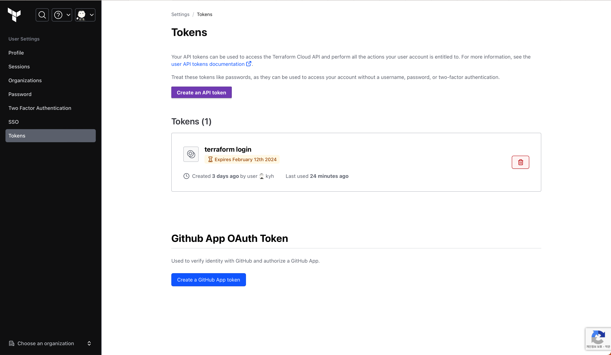

# Alwayz Infrastructure

Terraform-based AWS infrastructure management for the Alwayz platform, providing automated provisioning and management of cloud resources.

## Overview

This repository manages:
- **AWS Infrastructure**: EKS clusters, VPC, RDS, S3, and other AWS services
- **Datadog Monitoring**: Metrics, logs, and APM configuration
- **GitHub Repositories**: Automated repository management and settings
- **Sentry Error Tracking**: Application error monitoring setup

**Key Features:**
- Terraform Cloud integration for state management
- PR-based deployment workflow
- Multi-environment support (dev, beta, staging, prod)
- Automated CI/CD with GitHub Actions

## Directory Structure

```
terraform/
├── infra/
│   ├── aws/          # AWS resource management
│   ├── datadog/      # Datadog monitoring setup
│   ├── github/       # GitHub repository management
│   └── sentry/       # Sentry error tracking
└── config/           # Environment-specific tfvars
```

## Local Development Setup

### 1. Clone Repository

```bash
git clone https://github.com/wetripod/alwayz-infrastructure.git
cd alwayz-infrastructure
```

<br>

### 2. Install Terraform

```bash
# Homebrew on OS X
# https://developer.hashicorp.com/terraform/tutorials/aws-get-started/install-cli#install-terraform
brew tap hashicorp/tap
brew install hashicorp/tap/terraform
```

<br>

### 3. Terraform Cloud Authentication

```bash
# terraform login으로 인증 완료시, API Token을 발급할 수 있는 창이 생성된다.
# API Token을 발급받고, CLI 입력창에 입력하여 나의 로컬환경에 API Token키를 세팅한다.
terraform login

# API 토큰 설정 확인
more ~/.terraform.d/credentials.tfrc.json
```



<br>

### 4. Configure Workspace

```bash
export TF_WORKSPACE=alwayz-aws-{ENVIRONMENT}-infra

# example
# export TF_WORKSPACE=alwayz-aws-beta-infra
```

<br>

### 5. Initialize Terraform

```bash
terraform -chdir=terraform/infra/aws init
```

<br>

### 6. Validate Configuration

```bash
terraform -chdir=terraform/infra/aws plan
```

<br><br>

## Deployment Process


> 기본적으로 local에서는 terraform plan 레벨까지만 가능  
> 즉, 시스템으로 apply 행위를 제한했고, 무조건 PR merge 통해서만 가능

1. main 브랜치에서 feature 브랜치를 생성하여 작업
2. feature를 main브랜치를 타켓팅하여 PR 생성 -> terraform plan 진행
3. code review후, 최소 한명 승인
4. PR 병합 -> terraform apply 진행

<br><br>

## Development Tips

### 1. Using Terraform Console

- 다만 state 파일이 terraform cloud에서 관리되고 있고, 해당 파일은 동시성 제어가 필요하다. 그래서 하단의 명령을 실행할 경우, state 파일이 lock 상태로 변경되어 종료할 때까지 다른 작업자의 실행명령이 지연될 수 있다.

```bash
terraform -chdir=terraform/infra/aws console

Acquiring state lock. This may take a few moments...
> cidrsubnet("10.0.0.0/16", 4, 1)
"10.0.16.0/20
```

<br>

### 2. Code Formatting

```bash
terraform -chdir=terraform/infra/aws fmt
```

<br>

### 3. Code Validation

```bash
terraform -chdir=terraform/infra/aws validate

Success! The configuration is valid.
```

<br><br>

## References

- 👉 [Terraform에 대해서](https://www.notion.so/example-orginc/Terraform-9631b5d1b3774b55b1e9c203c1ebb211?pvs=4)
- 👉 [Basic CLI Features](https://developer.hashicorp.com/terraform/cli/commands)
- 👉 [Built-in Functions](https://developer.hashicorp.com/terraform/language/functions)

## License & Copyright

Copyright (c) 2024 **Kim YongHyun** (https://github.com/hulkong) and **Developer 2**

This project is licensed under the MIT License - see the [LICENSE](LICENSE) file for details.

### Authors

Created and maintained by:
- **Developer 1**
  - GitHub: [@hulkong](https://github.com/hulkong)
  - Email: cdfgogo0615@naver.com
  - Phone: 010-2763-9988
- **Developer 2**
  - GitHub: [@kimyoungjae96](https://github.com/kimyoungjae96)
  - Email: sskim5421@gmail.com
  - Phone: 010-5427-8851

### Acknowledgments

This Alwayz infrastructure codebase was designed and implemented by Kim YongHyun and Kim YoungJae for AWS resource management with Terraform.
